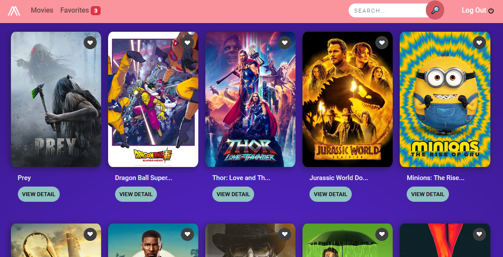

<!-- PROJECT LOGO -->
 

  

<h3 align="center">Movies Website</h3>

  

    Movies website built with React Js with login verification. Reponsive design.
     
    ¡CHECK DE INSTRUCTIONS SECTION BELOW TO SEE THE CREDENTIALS!
     
    <a href="https://rociogirardini.github.io/moviesWebsite/">Demo</a>
     
    <a href="https://github.com/rociogirardini/"><strong>Explore other projects »</strong></a>
     
     
  

<!-- TABLE OF CONTENTS -->

  
Table of Contents

  <ol>
    <li>
      <a href="#about-the-project">About The Project</a>
      <ul>
        <li><a href="#built-with">Built With</a></li>
        <li><a href="#status">Status</a></li>
        <li><a href="#Instructions">Instructions</a></li>
      </ul>
    </li>
    <li><a href="#contact">Contact</a></li>
  </ol>

<!-- ABOUT THE PROJECT -->
## About The Project

### Built With

* HTML5
* CSS3
* Bootstrap
* JavaScript
* React Js
* Axios

### Status

Done.

### Instructions

This project was built just for a challenge, so the credentials were specific, as is the use of the API.

The API usage is commented in the '<Login />' component so you can see the code, but the Demo works with the following credentials:

The email is 'tests@cinema.org', and the password is 'moviesWebsite'.

<!-- CONTACT -->
## Contact

Rocío de los Milagros Girardini - [@Linkedin](https://www.linkedin.com/in/rocio-girardini/) - rogirardini@gmail.com

Project Link: [https://rociogirardini.github.io/moviesWebsite/](https://rociogirardini.github.io/moviesWebsite/)
 
Repository Link: [https://github.com/rociogirardini/moviesWebsite](https://github.com/rociogirardini/moviesWebsite)

(<a href="#top">back to top</a>)
